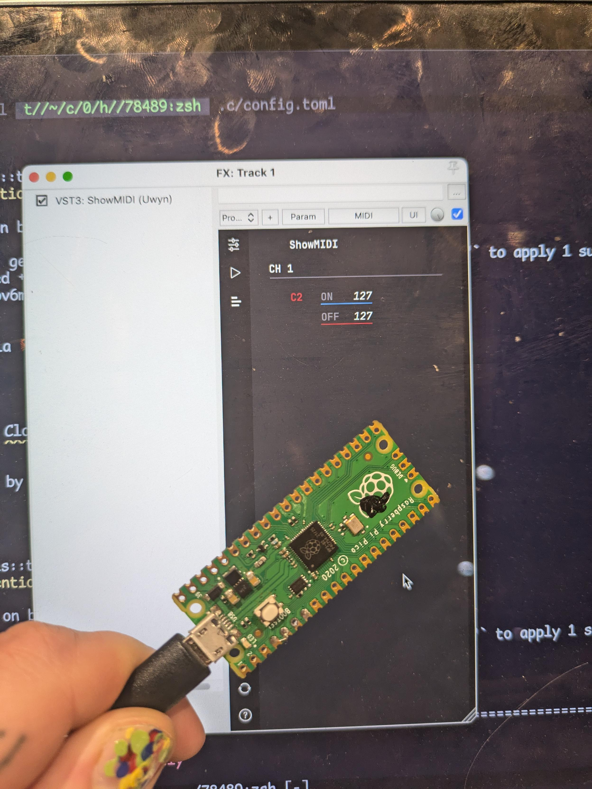

# Pico Rust USB MIDI controller

 

_The Raspberry Pi Pico sending note on/off messages to Reaper_

This is a simple example of how to program a Raspberry Pi Pico RP2040 using Rust and configure it as a USB Midi controller.

The code is based on [this template](https://github.com/rp-rs/rp2040-project-template) and uses [usbd-midi](https://crates.io/crates/usbd-midi).

The example code simply blinks the LED and sends a midi note on/off message. 

## Important note

When programming a USB Midi controller, NEVER put a delay in the main loop. This will cause the device to not be recognized on MacOS. Therefore, rather use a timer approach like in the code in this example.

## Development dependencies

You need the standard Rust tooling (cargo, rustup) which you can install from https://rustup.rs/. 

Then:

```bash
rustup target install thumbv6m-none-eabi
cargo install flip-link
# Installs the probe-rs tools, including probe-rs run, our recommended default runner
cargo install --locked probe-rs-tools
# If you want to use elf2uf2-rs instead, do...
cargo install --locked elf2uf2-rs
```

## Uploading the code to a board

It is currently set up to use `elf2uf-rs` for uploading the firmware to the Raspberry Pi Pico. Push the boot button on the Pico before plugging in the USB cable, then run `cargo run --release` 

More information [can be found here](https://github.com/rp-rs/rp2040-project-template#Running).
